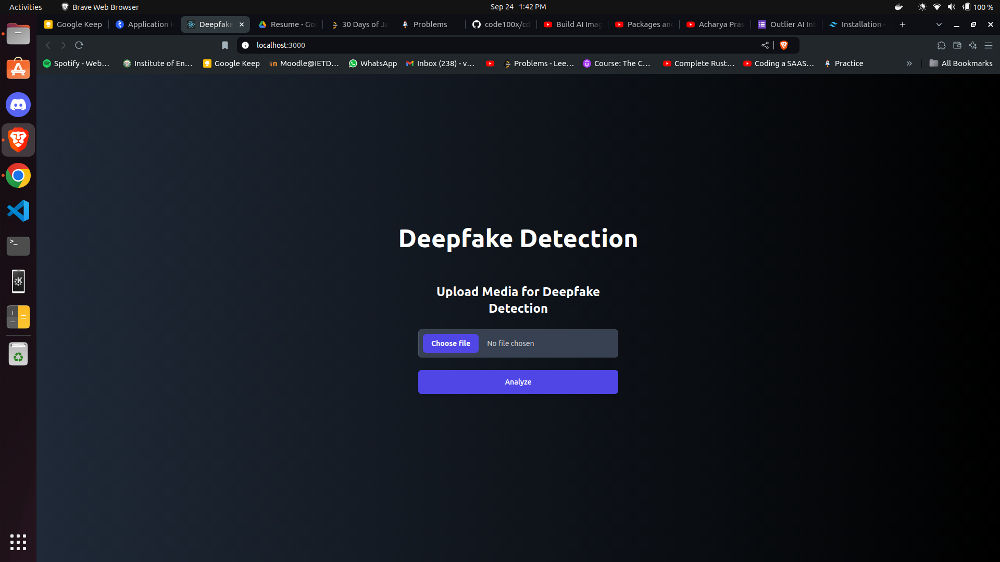

# Deepfake Detection Project

This project is a full-stack application for detecting deepfakes in images, audio, and video files.

# Screenshot




## Installation

1. Clone the repository:
   ```
   git clone https://github.com/Vedantjn/antei-assignment.git
   ```

2. Install dependencies for the client:
   ```
   cd client
   npm install
   ```

3. Install dependencies for the server:
   ```
   cd ../server
   npm install
   ```

## Running the Application

1. Start the server:
   ```
   cd server
   npm start
   ```

2. In a new terminal, start the client:
   ```
   cd client
   npm start
   ```

3. Open your browser and navigate to `http://localhost:3000` to use the application.

## Project Structure

- `client/`: React frontend application
- `server/`: Node.js backend application
  - `routes/`: Express routes
  - `utils/`: Utility functions for media processing

## Technologies Used

- Frontend: React, Tailwind CSS
- Backend: Node.js, Express
- Media Processing: sharp (images), fluent-ffmpeg (audio/video)

## Note

This project simulates deepfake detection by returning random results (for now)
